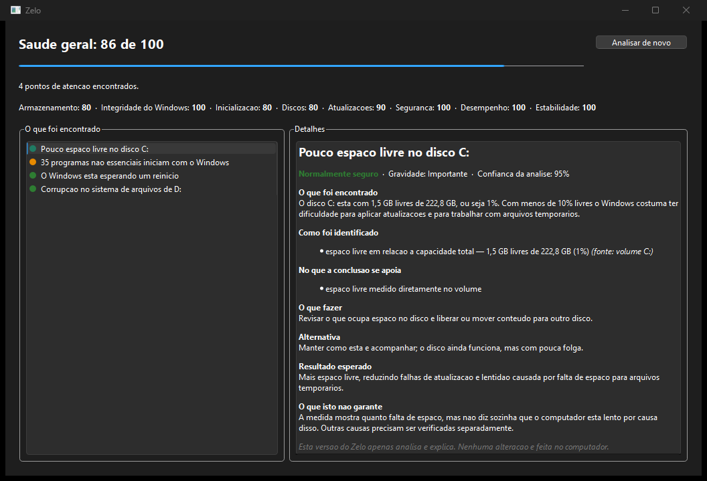

# Zelo

**Analisa e explica a saúde do seu Windows — sem promessas falsas.**

Zelo olha o computador, mostra o que encontrou e explica cada achado: de onde veio a
informação, o quanto ela sustenta a conclusão, qual o risco de agir e o que a
recomendação **não** garante.

Esta versão **não altera nada** no computador. Ela analisa, explica e para aí.

<p align="center">
  
</p>

> *Analyzes and explains Windows health in plain language, showing evidence, risk and
> limitations for every finding. Read-only by design. Written in C++20 with Qt 6.*

---

## Por que existe

Quem sente o computador lento raramente sabe o que fazer. As ferramentas disponíveis são
superficiais demais (limpadores que prometem milagre) ou técnicas demais (Visualizador de
Eventos, DISM, chkdsk). No meio disso, formata-se o computador por falta de informação.

O Zelo tenta ocupar esse meio: reunir o que o Windows já sabe sobre si mesmo e traduzir em
linguagem que dê para decidir.

## O que ele faz

Analisa nove áreas e produz uma pontuação por categoria, sempre com a causa visível:

| Área | O que observa |
|---|---|
| Armazenamento | espaço livre, arquivos temporários acumulados |
| Inicialização | programas que iniciam com o Windows, ignorando os essenciais |
| Estabilidade | falhas de aplicativo agrupadas por programa |
| Integridade | eventos de componente do Windows danificado |
| Discos | saúde física reportada e corrupção do sistema de arquivos |
| Atualizações | reinicialização pendente |
| Segurança | estado da proteção do Windows |
| Desempenho | memória disponível |

Cada achado responde: o que foi encontrado, como foi identificado, no que a conclusão se
apoia, o que fazer, qual a alternativa, o resultado esperado e **o que aquilo não garante**.

## Princípios de segurança

Estes são invariantes do projeto, não boas intenções. Vários deles têm teste próprio.

- **Nada é alterado sem autorização explícita.** Esta versão não altera nada, ponto.
- **Diretórios críticos são intocáveis.** `C:\Windows`, `Program Files`, `ProgramData` e o
  perfil do usuário formam uma deny-list. Exceções só existem como carve-outs revisados — e
  o construtor **recusa** uma exceção que englobe a própria raiz protegida, para que um
  engano derrube o build em vez do computador de alguém.
- **Ausência de dado nunca vira conclusão.** Cada área carrega um indicador de
  disponibilidade. Quando um coletor não consegue olhar, a análise diz "não observei" em vez
  de deixar o usuário achar que está tudo bem.
- **Confiança tem teto de 95%.** A análise trabalha com indícios; exibir 100% prometeria uma
  certeza que ela não tem.
- **Item de risco vermelho é apenas explicado.** O aplicativo nunca o executa.
- **Nada sai da máquina.** Sem telemetria, sem envio de dados, sem rede.

Detalhes em [docs/PLANEJAMENTO.md](docs/PLANEJAMENTO.md).

## Arquitetura

```
ui/          Qt Widgets — só apresenta, nunca decide
core/        modelos, risco, confiança, pontuação e regras
             C++20 puro: sem Qt, sem Windows.h, 100% testável
collectors/  Win32, WMI e log de eventos — somente leitura
scanner/     varredura de disco
storage/     histórico em JSON e registro em arquivo
```

O `core` não conhece Qt nem Windows. É por isso que as regras de análise rodam inteiras em
teste, sem abrir janela e sem tocar no sistema, e é o que torna a interface substituível.

Os coletores preenchem um `SystemSnapshot`; as regras leem dele e produzem recomendações.
Nenhuma regra consulta o sistema por conta própria.

## Stack

C++20 · Qt 6.8 (Widgets) · CMake + Ninja · Catch2 · nlohmann/json · spdlog

Sem banco de dados: o histórico são arquivos JSON legíveis, com escrita atômica.

## Como compilar

Requer Qt 6.8 com MinGW. Instalação sem conta, via [aqtinstall](https://github.com/miurahr/aqtinstall):

```bash
python -m pip install aqtinstall
python -m aqt install-qt windows desktop 6.8.3 win64_mingw -O C:/Qt --archives qtbase qttools
python -m aqt install-tool windows desktop tools_mingw1310 -O C:/Qt
python -m aqt install-tool windows desktop tools_cmake -O C:/Qt
python -m aqt install-tool windows desktop tools_ninja -O C:/Qt
```

O `aqtinstall` não altera o PATH, então aponte as ferramentas antes de compilar. No
PowerShell, valendo para a sessão atual:

```powershell
$env:PATH = "C:\Qt\Tools\CMake_64\bin;C:\Qt\Tools\Ninja;C:\Qt\6.8.3\mingw_64\bin;C:\Qt\Tools\mingw1310_64\bin;$env:PATH"
$env:QT_ROOT = "C:/Qt/6.8.3/mingw_64"
```

Os presets leem `QT_ROOT` do ambiente. Assim o repositório não carrega caminho de
máquina nenhuma, e quem instalou o Qt em outro lugar só ajusta essas duas linhas.

Compilar e testar:

```bash
cmake --preset debug && cmake --build --preset debug && ctest --preset debug
```

Gerar uma pasta distribuível:

```bash
cmake --build --preset release && cmake --install build/release --prefix dist
```

A pasta `dist` leva o Qt junto e roda em qualquer Windows, sem nada instalado.

## Estado

**v0.1 — somente leitura.** Analisa, explica e simula. Nunca altera.

Planejado para depois: limpeza dos itens de risco verde com pré-visualização e quarentena,
desativação reversível de itens de inicialização, movimentação segura de arquivos e execução
autorizada de comandos oficiais do Windows — sempre com evidência antes, confirmação no meio
e registro depois.

## Limitações

Escritas aqui pelo mesmo motivo que aparecem na interface: um programa que analisa
computador precisa ser claro sobre o que não sabe.

- Não substitui antivírus, não procura ameaças e não detecta infecção.
- Não conserta hardware. Quando há indício de disco falhando, ele recomenda backup e
  avaliação técnica — não um comando.
- A pontuação é orientação, não diagnóstico. Serve para dirigir atenção.
- Alguns problemas só se resolvem com reinstalação de aplicativo, atualização de driver,
  troca de peça, reparo avançado ou reinstalação do Windows. O Zelo diz isso quando é o caso.

## Licença

MIT.
